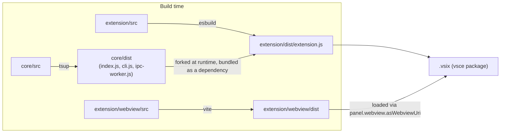

# Architecture — Build & Package

Three independent build outputs, one `.vsix`.

## Why three, not one

- `core` is built by `tsup` because it emits four separate entrypoints
  (`index`, `cli`, `ipc-worker` — see [PROCESS-BOUNDARY.md](./PROCESS-BOUNDARY.md) — and
  `path-utils`, its own dedicated export so `extension/src/watcher.ts` can import
  `isExcludedPath` without pulling in `analyze.ts`'s dependency-cruiser graph) as
  importable/executable JS, not a single bundle.
- `extension/src` is built by `esbuild` with `vscode` marked external — it runs inside the
  extension host process, which already provides that module.
- `extension/webview/src` is built by `vite` as a standalone web app — it runs inside an
  iframe-like webview sandbox with no Node APIs at all, so it cannot share a bundler config
  with the host.

## Dependency direction

`core` ships as a **real npm dependency** of `extension` (declared in
`extension/package.json`, not referenced by relative path), so `vsce package` bundles
`core/dist` into the `.vsix` correctly. This also means `core` is independently
`npm publish`-able later without depending on the whole extension package — the
reusability [decisions/0002](../decisions/0002-portable-core-zero-vscode-deps.md) exists for.

See [REPO-STANDARDS.md](./REPO-STANDARDS.md) for what does and doesn't ship inside the
`.vsix` itself.
