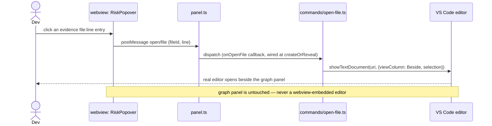

# Architecture — End-to-End Flows

Five flows cover every way data moves through the system as of v2.0. The first four were v1's
whole scope ("if a new feature needs a fifth, it doesn't belong in v1" — that line is now
history, not a live constraint: v2.0's micro view earned flow 5 by proving the macro layer
true and fast first, per `docs/planning/ROADMAP-V2.md`'s own promotion order). A v2.1+ feature
needing a sixth still belongs in its own layer's turn, not bolted onto an unrelated flow here.

## 1. Cold analyze (first time a repo is opened)

```mermaid
sequenceDiagram
    actor Dev
    participant VSC as VS Code
    participant Ext as extension.ts
    participant Panel as panel.ts
    participant Runner as analysis-runner.ts
    participant Worker as core: ipc-worker.ts (forked)
    participant WV as webview: App.tsx

    Dev->>VSC: Run "BlockNet: Show Architecture"
    VSC->>Ext: command fires
    Ext->>Panel: create/reveal WebviewPanel
    Panel->>WV: load html shell (CSP, fonts) — fresh navigation every call, see PROTOCOL.md
    WV->>WV: main.tsx mounts App; subscribes window 'message' listener
    WV->>Panel: postMessage webview/ready
    Panel->>Ext: whenReady() resolves
    Note over Ext,WV: nothing below is posted before webview/ready — VS Code drops any\npostMessage sent before the listener above is registered, no queue (PROTOCOL.md)
    Ext->>Ext: commands/show-architecture.ts's state.ts: getPositions() from workspaceState (sparse, empty on first-ever open)
    Ext-->>Panel: postMessage layout/restore
    Panel-->>WV: layout/restore
    WV->>WV: App.tsx's LiveApp stores positions in useState (not yet rendered — no graph/macro yet)
    Ext->>Runner: analyze(workspaceRoot)
    Runner->>Worker: fork + send({rootDir, cacheDir})
    Worker-->>Runner: progress(blocks, 1/4) ... (edges, 2/4) ... (risks, 3/4) ... (cache, 4/4)
    Runner-->>Panel: postMessage analysis/progress (×4)
    Panel-->>WV: analysis/progress
    WV->>WV: LiveApp shows "Analyzing — {phase} {done}/{total}"
    Worker-->>Runner: result: GraphResult
    Runner->>Ext: GraphResult
    Ext->>Ext: git.ts: getDirtyFiles(rootDir); dirty-blocks.ts: dirtyBlockIds(blocks, dirtyFiles) — augments each block with `dirty` (Task 9, STATE-OWNERSHIP.md: queried live, never cached)
    Ext-->>Panel: postMessage graph/macro (nodes: WebviewBlockNode[]), risks/update
    Panel-->>WV: graph/macro, risks/update
    WV->>WV: layout.ts computes dagre; camera-store.ts layers layout/restore's\npositions over it for any id present there
    WV-->>Dev: BlockCanvas renders
```

## 2. Incremental re-analyze (developer saves a file)

```mermaid
sequenceDiagram
    actor Dev
    participant FS as Filesystem
    participant Watcher as watcher.ts
    participant Runner as analysis-runner.ts
    participant Worker as core: ipc-worker.ts (forked)
    participant Ext as extension.ts
    participant WV as webview

    Dev->>FS: save file.ts (× N within the debounce window)
    FS-->>Watcher: onDidChange (× N)
    Watcher->>Watcher: buffer changed paths, debounce ~500ms
    Watcher->>Runner: analyze(workspaceRoot, {changedFiles: [...buffered]})
    Runner->>Runner: assign generation id G, record as latest
    Runner->>Worker: fork + send({..., changedFiles})
    Worker->>Worker: cache/invalidate.ts scopes edge re-extraction to the\nchanged files' own edges + dependents' block edges;\nTarjan SCC re-runs on the full (cached+fresh) edge list — see decisions/0008
    Worker-->>Runner: result: GraphResult (delta, same shape as full), tagged G
    Runner->>Runner: if G is still the latest generation, forward;\nif a newer run superseded it, discard silently
    Runner->>Ext: GraphResult
    Ext->>Ext: git.ts + dirty-blocks.ts re-augment blocks with `dirty` (same as flow 1 — queried fresh on every push, not just cold open)
    Ext-->>WV: postMessage graph/macro, risks/update
    WV->>WV: graph-store diff-merges by id; React re-renders\nonly the changed nodes/edges
```

### 2a. Why debounce + generation tagging, not a queue

`watcher.ts` coalesces file events into one buffered `changedFiles` set per ~500ms window
before triggering `analyze()` at all — an 8-file save (a formatter running across a
multi-file selection, a branch switch) becomes one run, not eight forked workers. If a
second trigger still manages to fire while a run is in flight (e.g. two edits straddle the
debounce boundary), `analysis-runner.ts` does not queue it behind the first — it forks a new
worker immediately and tags both runs with a monotonically increasing generation id. Only
the result whose generation matches the latest one issued is ever forwarded to the webview;
a slower, now-stale run's result is discarded on arrival. This guarantees the webview never
regresses to older data because an older analysis happened to finish last, without needing
any inter-process cancellation.

The config-change case (`tsconfig.json`, `package.json`) is not incremental —
`watcher.ts` detects it and calls `analyze()` **without** `changedFiles`, forcing the
full-scan path (still debounced and generation-tagged the same way). Same function, same
worker, different `AnalyzeOptions`.

**Implementation note (Task 5, 2026-07-19, reconfirmed unchanged through Task 8):** `analyze()`
does not actually read `changedFiles` — as built, `cache/invalidate.ts` re-derives the dirty
set itself by diffing a freshly-hashed `CacheManifest` against the previous one
(docs/decisions/0008), rather than trusting the caller's hint. The outcome this diagram
describes (scoped re-extraction for a content edit, full rescan for a config change) is what
Task 5 actually produces either way; `changedFiles` remains unread by any code path. Wiring it
as a perf optimization (skip hashing the full tree) is not planned work — not in
docs/planning/TASKS-V1.md or ROADMAP-V2.md — so it isn't tracked as a pending decision here;
if it becomes worth doing, it needs its own ADR (a real behavior change to what gets hashed),
not a note in this flow doc.

## 3. Open-in-editor (risk evidence click)



Task 9's original plan was also a block-card ⤢ triggering the identical `open/file` flow. Not
built: a block is always a directory (`BlockNode.path`), never a single file — there's no
canonical file for a block-level ⤢ to target without a drill-down step v1 doesn't have (the
design-handoff prototype confirms this: its ⤢ affordance only ever exists on file-level
cards). As of v2.0, `FileCard`'s ⤢ (`extension/webview/src/flow/FileCard.tsx`, flow 5 below)
is exactly that file-level trigger — a second sender into this same flow, `commands/
open-file.ts` unchanged. `open/diff` (`vscode.diff` working-tree vs HEAD) is defined in the
protocol but still has no UI sender anywhere, block or file level.

## 4. Layout persistence (drag a node, or bend an edge — ROADMAP-V2.md)

```mermaid
sequenceDiagram
    actor Dev
    participant WV as webview: BlockCanvas / RiskEdge
    participant Cam as camera-store.ts
    participant Panel as panel.ts
    participant State as state.ts

    Dev->>WV: drag a block card, OR drag an edge's waypoint handle
    WV->>Cam: movePosition(id, pos) OR moveWaypoints(edgeId, waypoints[])\n(waypoints is always the FULL replacement array for that edge, never a single\npoint to merge — an empty array removes the override entirely, same\nabsent-id-falls-through-to-computed-default contract as positions;\noptimistic, instant, local only)
    Cam->>Cam: debounce ~300ms (ONE shared timer for both maps — a position\ndrag and a waypoint drag close together in time coalesce into one send)
    Cam->>Panel: postMessage layout/persist {positions, edgeWaypoints}
    Panel->>State: onLayoutPersist(positions, edgeWaypoints) → setPositions(...) +\nsetEdgeWaypoints(context.workspaceState, edgeWaypoints)
    Note over WV,State: on next panel open, commands/show-architecture.ts reads state.ts\nand awaits panel.whenReady() before pushing layout/restore BEFORE\ngraph/macro — first paint has no flash. panel.ts doesn't import state.ts\ndirectly — onLayoutPersist is a callback show-architecture.ts supplies at\ncreateOrReveal() time, so panel.ts stays a generic message-lifecycle shell
```

An edge's waypoint handle renders via React Flow's `EdgeLabelRenderer` (a shared HTML overlay
above all edges' SVG, not an SVG element inside the edge's own group — an inline SVG circle was
tried first and found, live, to lose hit-testing to unrelated edges' own wide interaction
strokes) and counter-scales by `1/zoom` so it stays a constant, grabbable size regardless of how
zoomed out the canvas is (`PROTOCOL.md`'s "Draggable edge waypoints" section has the full
mechanism, including two real bugs found via live Playwright testing during this feature's own
build and how each was fixed).

## 5. Micro dive-in (block double-click) — v2.0

```mermaid
sequenceDiagram
    actor Dev
    participant WV as webview: GraphView/BlockCanvas
    participant Panel as panel.ts
    participant Cmd as commands/show-architecture.ts
    participant Runner as analysis-runner.ts
    participant Worker as core: ipc-worker.ts (forked, mode:'micro')

    Dev->>WV: double-click a block card
    WV->>WV: GraphView.handleDive(blockId) — phase:'diving', shows a loading indicator;\nmacro layer stays fully visible and interactive (no optimistic cross-fade — a real\nhost round-trip is in flight, "never fake it")
    WV->>Panel: postMessage graph/micro/request {blockId}
    Panel->>Cmd: dispatch (onMicroRequest callback, wired at createOrReveal)
    Cmd->>Runner: runMicro({rootDir, cacheDir, blockId}) — independent generation\ncounter from macro's own (PROTOCOL.md)
    Runner->>Worker: fork + send({mode:'micro', rootDir, cacheDir, blockId})
    Worker->>Worker: analyze-micro.ts: readCache() → one whole-repo walkRealFiles(rootDir)\nfiltered by resolveBlock() to this block's files (matches computeBlockShape()'s own\nfileCount exactly — a per-block-scoped walk diverged on nested blocks and\ncross-block symlinks, both found via real-repo verification) + real LOC (skipped,\ndegrades to 0, for anything over 2MB) + re-run findCyclicFileEdges() over the\ncached fileEdges — no dependency-cruiser re-cruise
    alt cache has this block
        Worker-->>Runner: send({type:'micro-result', micro: MicroGraphResult})
        Runner->>Cmd: MicroOutcome success
        Cmd->>Cmd: git.ts: getDirtyFiles(rootDir) — direct membership, not\ndirty-blocks.ts's path-prefix aggregation (file granularity is exact)
        Cmd-->>Panel: postMessage graph/micro {blockId, files: WebviewMicroFileNode[], edges}
    else no cache yet, or blockId no longer in the cached snapshot
        Worker-->>Runner: send({type:'error', message})
        Runner->>Cmd: MicroOutcome error
        Cmd-->>Panel: postMessage graph/micro/error {blockId, message}
    end
    Panel-->>WV: graph/micro or graph/micro/error
    WV->>WV: GraphView compares the response's blockId against its own local\npendingBlockId (discards a late response for a block the user has since\nnavigated away from) — success: mounts FileCanvas, cross-fades in\n(~0.45–0.5s); error: stays on macro, shows an inline banner (~4s)
    WV-->>Dev: file-level graph renders, or a friendly inline notice
```

Every fork here is one-shot (same "fork → one message in → one message out → kill" lifecycle
as the macro flow, `PROCESS-BOUNDARY.md`) and gated by its own `isLatestMicro()` generation
counter — see `PROTOCOL.md`'s "Micro (file-level) requests" section for the full dual-gate (and
webview-side third layer) race-safety argument, the same class of stale-post bug Task 9's
review already found and fixed once for `graph/macro`. `analyze-micro.ts` never re-runs
dependency-cruiser — it's a read of the last macro run's cache (`cache/store.ts`'s persisted
`fileEdges`) plus one whole-repo `walkRealFiles` call filtered to the requested block, which is
what keeps a double-click cheap relative to a full re-analysis (a full re-cruise of
`AetherArenaV2`'s real ~6,500-file repo takes ~5s; the equivalent micro request's walk-and-
filter takes well under a second for every real block measured, including its ~5,300-file
`open-connector` block) — cheap relative to the alternative, not literally independent of
total repo size, since the walk itself does scan every real file, once, per request.

## 6. File-level layout persistence (drag a file card, or bend a file edge — ROADMAP-V2.md)

```mermaid
sequenceDiagram
    actor Dev
    participant WV as webview: FileCanvas / GraphView
    participant Cam as camera-store.ts (second instance)
    participant Panel as panel.ts
    participant State as state.ts

    Dev->>WV: drag a file card, OR drag a file edge's waypoint handle (micro view)
    WV->>Cam: movePosition(id, pos) OR moveWaypoints(edgeId, waypoints[])\n(optimistic, instant, local only)
    Cam->>Cam: debounce ~300ms (its own timer, independent of the macro\ninstance's — the two hooks never share a debounce)
    Cam->>Panel: postMessage layout/file-persist {filePositions, fileEdgeWaypoints}
    Panel->>State: onFileLayoutPersist(filePositions, fileEdgeWaypoints) →\nsetFilePositions(...) + setFileEdgeWaypoints(context.workspaceState, ...)
    Note over WV,State: same layout/restore-before-graph/macro ordering guarantee applies to\nthe file-level pair once a micro dive re-requests them — no separate\nrestore message exists for file-level layout; it rides the same\nlayout/restore payload as the macro maps
```

This is flow 4's exact mechanism, scoped to the micro (per-block, file-level) view rather than
the macro (block-level) one — not a different mechanism, a second instance of it.
`GraphView.tsx` owns a SECOND, independent `useCameraStore` call (distinct from
`BlockCanvas.tsx`'s own internal instance) specifically because `FileCanvas` remounts fresh on
every dive; living at `GraphView` level instead means a drag made during one dive is still
current React state the very next dive reads, rather than resetting to whatever
`initialFilePositions` prop was current at that earlier mount. Its `persist` callback posts
`layout/file-persist` (`filePositions`, `fileEdgeWaypoints`) instead of the macro
`layout/persist` (`positions`, `edgeWaypoints`) — a distinct message shape/workspaceState-key
pair (`protocol.ts`), not two more fields folded onto the macro message, so the two hooks'
debounce timers stay fully independent and neither's persist can be mistaken for the other's by
the host. `panel.ts` dispatches it to an `onFileLayoutPersist` callback wired at
`createOrReveal()` time, exactly parallel to `onLayoutPersist`; `commands/show-architecture.ts`
supplies that callback, calling `state.ts`'s `setFilePositions` and `setFileEdgeWaypoints` — two
separate `memento.update()` writes to their own workspaceState keys
(`blocknet.filePositions`, `blocknet.fileEdgeWaypoints`), same accepted non-atomicity as the
macro pair (view state, not import truth — a lost write just means a drag needs redoing).
