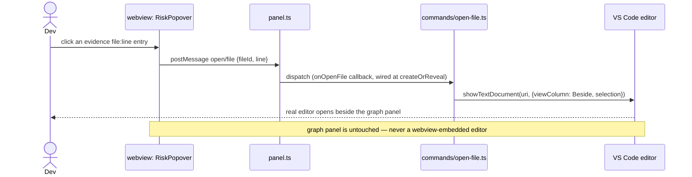
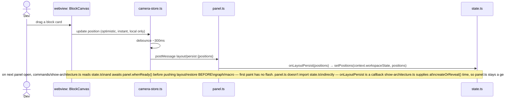

# Architecture — End-to-End Flows

Four flows cover every way data moves through the system. If a new feature needs a fifth,
it doesn't belong in v1 (check `docs/planning/ROADMAP-V2.md`).

## 1. Cold analyze (first time a repo is opened)

```mermaid
sequenceDiagram
    actor Dev
    participant VSC as VS Code
    participant Ext as extension.ts
    participant Panel as panel.ts
    participant Runner as analysis-runner.ts
    participant Worker as core: ipc-worker.ts (forked)
    participant WV as webview: App.tsx

    Dev->>VSC: Run "BlockNet: Show Architecture"
    VSC->>Ext: command fires
    Ext->>Panel: create/reveal WebviewPanel
    Panel->>WV: load html shell (CSP, fonts) — fresh navigation every call, see PROTOCOL.md
    WV->>WV: main.tsx mounts App; subscribes window 'message' listener
    WV->>Panel: postMessage webview/ready
    Panel->>Ext: whenReady() resolves
    Note over Ext,WV: nothing below is posted before webview/ready — VS Code drops any\npostMessage sent before the listener above is registered, no queue (PROTOCOL.md)
    Ext->>Ext: commands/show-architecture.ts's state.ts: getPositions() from workspaceState (sparse, empty on first-ever open)
    Ext-->>Panel: postMessage layout/restore
    Panel-->>WV: layout/restore
    WV->>WV: App.tsx's LiveApp stores positions in useState (not yet rendered — no graph/macro yet)
    Ext->>Runner: analyze(workspaceRoot)
    Runner->>Worker: fork + send({rootDir, cacheDir})
    Worker-->>Runner: progress(blocks, 1/4) ... (edges, 2/4) ... (risks, 3/4) ... (cache, 4/4)
    Runner-->>Panel: postMessage analysis/progress (×4)
    Panel-->>WV: analysis/progress
    WV->>WV: LiveApp shows "Analyzing — {phase} {done}/{total}"
    Worker-->>Runner: result: GraphResult
    Runner->>Ext: GraphResult
    Ext->>Ext: git.ts: getDirtyFiles(rootDir); dirty-blocks.ts: dirtyBlockIds(blocks, dirtyFiles) — augments each block with `dirty` (Task 9, STATE-OWNERSHIP.md: queried live, never cached)
    Ext-->>Panel: postMessage graph/macro (nodes: WebviewBlockNode[]), risks/update
    Panel-->>WV: graph/macro, risks/update
    WV->>WV: layout.ts computes dagre; camera-store.ts layers layout/restore's\npositions over it for any id present there
    WV-->>Dev: BlockCanvas renders
```

## 2. Incremental re-analyze (developer saves a file)

```mermaid
sequenceDiagram
    actor Dev
    participant FS as Filesystem
    participant Watcher as watcher.ts
    participant Runner as analysis-runner.ts
    participant Worker as core: ipc-worker.ts (forked)
    participant Ext as extension.ts
    participant WV as webview

    Dev->>FS: save file.ts (× N within the debounce window)
    FS-->>Watcher: onDidChange (× N)
    Watcher->>Watcher: buffer changed paths, debounce ~500ms
    Watcher->>Runner: analyze(workspaceRoot, {changedFiles: [...buffered]})
    Runner->>Runner: assign generation id G, record as latest
    Runner->>Worker: fork + send({..., changedFiles})
    Worker->>Worker: cache/invalidate.ts scopes edge re-extraction to the\nchanged files' own edges + dependents' block edges;\nTarjan SCC re-runs on the full (cached+fresh) edge list — see decisions/0008
    Worker-->>Runner: result: GraphResult (delta, same shape as full), tagged G
    Runner->>Runner: if G is still the latest generation, forward;\nif a newer run superseded it, discard silently
    Runner->>Ext: GraphResult
    Ext->>Ext: git.ts + dirty-blocks.ts re-augment blocks with `dirty` (same as flow 1 — queried fresh on every push, not just cold open)
    Ext-->>WV: postMessage graph/macro, risks/update
    WV->>WV: graph-store diff-merges by id; React re-renders\nonly the changed nodes/edges
```

### 2a. Why debounce + generation tagging, not a queue

`watcher.ts` coalesces file events into one buffered `changedFiles` set per ~500ms window
before triggering `analyze()` at all — an 8-file save (a formatter running across a
multi-file selection, a branch switch) becomes one run, not eight forked workers. If a
second trigger still manages to fire while a run is in flight (e.g. two edits straddle the
debounce boundary), `analysis-runner.ts` does not queue it behind the first — it forks a new
worker immediately and tags both runs with a monotonically increasing generation id. Only
the result whose generation matches the latest one issued is ever forwarded to the webview;
a slower, now-stale run's result is discarded on arrival. This guarantees the webview never
regresses to older data because an older analysis happened to finish last, without needing
any inter-process cancellation.

The config-change case (`tsconfig.json`, `package.json`) is not incremental —
`watcher.ts` detects it and calls `analyze()` **without** `changedFiles`, forcing the
full-scan path (still debounced and generation-tagged the same way). Same function, same
worker, different `AnalyzeOptions`.

**Implementation note (Task 5, 2026-07-19, reconfirmed unchanged through Task 8):** `analyze()`
does not actually read `changedFiles` — as built, `cache/invalidate.ts` re-derives the dirty
set itself by diffing a freshly-hashed `CacheManifest` against the previous one
(docs/decisions/0008), rather than trusting the caller's hint. The outcome this diagram
describes (scoped re-extraction for a content edit, full rescan for a config change) is what
Task 5 actually produces either way; `changedFiles` remains unread by any code path. Wiring it
as a perf optimization (skip hashing the full tree) is not planned work — not in
docs/planning/TASKS-V1.md or ROADMAP-V2.md — so it isn't tracked as a pending decision here;
if it becomes worth doing, it needs its own ADR (a real behavior change to what gets hashed),
not a note in this flow doc.

## 3. Open-in-editor (risk evidence click)



Task 9's original plan was also a block-card ⤢ triggering the identical `open/file` flow. Not
built: a block is always a directory (`BlockNode.path`), never a single file — there's no
canonical file for a block-level ⤢ to target without a drill-down step v1 doesn't have (the
design-handoff prototype confirms this: its ⤢ affordance only ever exists on file-level
cards). Deferred to `ROADMAP-V2.md`'s v2.0 micro view, where each card is a single file. `open/
diff` (`vscode.diff` working-tree vs HEAD) is defined in the protocol but has the same gap —
no v1 UI sends it — and is deferred alongside it.

## 4. Layout persistence (drag a node)


