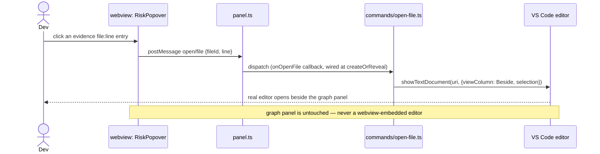

# Architecture — End-to-End Flows

Four flows cover every way data moves through the system as of v2.0.1. The first four were v1's
whole scope ("if a new feature needs a fifth, it doesn't belong in v1" — that line is now
history, not a live constraint: v2.0's original micro view earned a fifth flow by proving the
macro layer true and fast first, and v2.0.1's unified layer model then absorbed that fifth flow
plus a sixth back into flow 1's bootstrap and one generalized "Layer navigation" flow below, per
`docs/planning/ROADMAP-V2.md`'s own promotion order). A v2.1+ feature needing a fifth again still
belongs in its own layer's turn, not bolted onto an unrelated flow here.

## 1. Cold analyze (first time a repo is opened)

```mermaid
sequenceDiagram
    actor Dev
    participant VSC as VS Code
    participant Ext as extension.ts
    participant Panel as panel.ts
    participant Runner as analysis-runner.ts
    participant Worker as core: ipc-worker.ts (forked)
    participant WV as webview: App.tsx

    Dev->>VSC: Run "BlockNet: Show Architecture"
    VSC->>Ext: command fires
    Ext->>Panel: create/reveal WebviewPanel
    Panel->>WV: load html shell (CSP, fonts) — fresh navigation every call, see PROTOCOL.md
    WV->>WV: main.tsx mounts App; subscribes window 'message' listener
    WV->>Panel: postMessage webview/ready
    Panel->>Ext: whenReady() resolves
    Note over Ext,WV: nothing below is posted before webview/ready — VS Code drops any\npostMessage sent before the listener above is registered, no queue (PROTOCOL.md)
    Ext->>Ext: commands/show-architecture.ts's state.ts: getPositions() from workspaceState (sparse, empty on first-ever open)
    Ext-->>Panel: postMessage layout/restore
    Panel-->>WV: layout/restore
    WV->>WV: App.tsx's LiveApp stores positions in useState (not yet rendered — no layer data yet)
    Ext->>Runner: analyze(workspaceRoot)
    Runner->>Worker: fork + send({rootDir, cacheDir})
    Worker-->>Runner: progress(blocks, 1/4) ... (edges, 2/4) ... (risks, 3/4) ... (cache, 4/4)
    Runner-->>Panel: postMessage analysis/progress (×4)
    Panel-->>WV: analysis/progress
    WV->>WV: LiveApp shows "Analyzing — {phase} {done}/{total}"
    Worker-->>Runner: result: GraphResult
    Runner->>Ext: GraphResult
    Ext->>Ext: git.ts: getDirtyFiles(rootDir); dirty-blocks.ts: dirtyBlockIds(blocks, dirtyFiles) — augments each block with `dirty` (Task 9, STATE-OWNERSHIP.md: queried live, never cached)
    Ext-->>Panel: postMessage graph/macro (nodes: WebviewBlockNode[]), risks/update
    Panel-->>WV: graph/macro, risks/update
    WV->>WV: v2.0.1: graph/macro's own payload is NOT rendered — its arrival is the signal\nto issue graph/layer/request({layerPath: currentLayerPathRef.current}), which on\na cold open is '' (root, the ref's initial value)
    WV->>Panel: postMessage graph/layer/request {layerPath: ''}
    Panel->>Ext: dispatch (onLayerRequest callback)
    Ext->>Runner: runLayer({rootDir, cacheDir, layerPath: ''}) — independent generation\ncounter from macro's own (PROTOCOL.md)
    Runner->>Worker: fork + send({mode:'layer', rootDir, cacheDir, layerPath: ''})
    Worker->>Worker: analyze-layer.ts: readCache() → itemsForLayer('') (mixes block-aggregate\nand plain-folder/file items — the layer-0 boundary computation, ROADMAP-V2.md's\nunified layer model) → resolveLayerConnections() → groupDocFiles()
    Worker-->>Runner: send({type:'layer-result', layer: LayerGraphResult})
    Runner->>Ext: LayerOutcome success
    Ext->>Ext: git.ts + dirty-blocks.ts augment items with `dirty` (folder: path-prefix;\nfile: exact path; doc stack: any constituent file)
    Ext-->>Panel: postMessage graph/layer {layerPath:'', items: WebviewLayerItem[], edges, arrows}
    Panel-->>WV: graph/layer
    WV->>WV: GraphView's initial-load guard seeds shownData (React's "adjust state\nduring render" pattern, self-limiting); layer-layout.ts computes the layout,\ncamera-store.ts layers layout/restore's positions over it for any id present there
    WV-->>Dev: LayerCanvas renders layer 0 (blocks, plain folders, and loose files mixed together)
```

## 2. Incremental re-analyze (developer saves a file)

```mermaid
sequenceDiagram
    actor Dev
    participant FS as Filesystem
    participant Watcher as watcher.ts
    participant Runner as analysis-runner.ts
    participant Worker as core: ipc-worker.ts (forked)
    participant Ext as extension.ts
    participant Panel as panel.ts
    participant WV as webview

    Dev->>FS: save file.ts (× N within the debounce window)
    FS-->>Watcher: onDidChange (× N)
    Watcher->>Watcher: buffer changed paths, debounce ~500ms
    Watcher->>Runner: analyze(workspaceRoot, {changedFiles: [...buffered]})
    Runner->>Runner: assign generation id G, record as latest
    Runner->>Worker: fork + send({..., changedFiles})
    Worker->>Worker: cache/invalidate.ts scopes edge re-extraction to the\nchanged files' own edges + dependents' block edges;\nTarjan SCC re-runs on the full (cached+fresh) edge list — see decisions/0008
    Worker-->>Runner: result: GraphResult (delta, same shape as full), tagged G
    Runner->>Runner: if G is still the latest generation, forward;\nif a newer run superseded it, discard silently
    Runner->>Ext: GraphResult
    Ext->>Ext: git.ts + dirty-blocks.ts re-augment blocks with `dirty` (same as flow 1 — queried fresh on every push, not just cold open)
    Ext-->>Panel: postMessage graph/macro, risks/update
    Panel-->>WV: graph/macro, risks/update
    WV->>WV: graph/macro's arrival re-triggers graph/layer/request — critically, for\nwhatever layerPath is CURRENT (App.tsx's currentLayerPathRef, updated on every\nlayer navigation GraphView issues), not hardcoded to root. A save while the\nuser is several layers deep must refresh what they're actually looking at —\nGraphView only ever applies a graph/layer response whose layerPath matches its\nown current or in-flight layer, so re-requesting root unconditionally would\nleave a deep layer showing stale pre-edit data until the user manually\nbacked all the way out and back in (a real gap found and fixed while\nreconciling this flow against the shipped code, not a hypothetical)
    WV->>Panel: postMessage graph/layer/request {layerPath: <current>}
    Panel->>Ext: dispatch (onLayerRequest callback)
    Note over WV,Ext: same round trip as flow 1's tail, and flow 4's — one mechanism,\nanswering "what does layer X look like right now"
    Ext-->>Panel: postMessage graph/layer (fresh items/edges/arrows for that same layer)
    Panel-->>WV: graph/layer
    WV->>WV: LayerCanvas re-renders in place — React's own keyed reconciliation handles\nthe diff, no explicit merge step needed
```

### 2a. Why debounce + generation tagging, not a queue

`watcher.ts` coalesces file events into one buffered `changedFiles` set per ~500ms window
before triggering `analyze()` at all — an 8-file save (a formatter running across a
multi-file selection, a branch switch) becomes one run, not eight forked workers. If a
second trigger still manages to fire while a run is in flight (e.g. two edits straddle the
debounce boundary), `analysis-runner.ts` does not queue it behind the first — it forks a new
worker immediately and tags both runs with a monotonically increasing generation id. Only
the result whose generation matches the latest one issued is ever forwarded to the webview;
a slower, now-stale run's result is discarded on arrival. This guarantees the webview never
regresses to older data because an older analysis happened to finish last, without needing
any inter-process cancellation.

The config-change case (`tsconfig.json`, `package.json`) is not incremental —
`watcher.ts` detects it and calls `analyze()` **without** `changedFiles`, forcing the
full-scan path (still debounced and generation-tagged the same way). Same function, same
worker, different `AnalyzeOptions`.

**Implementation note (Task 5, 2026-07-19, reconfirmed unchanged through v2.0.1):** `analyze()`
does not actually read `changedFiles` — as built, `cache/invalidate.ts` re-derives the dirty
set itself by diffing a freshly-hashed `CacheManifest` against the previous one
(docs/decisions/0008), rather than trusting the caller's hint. The outcome this diagram
describes (scoped re-extraction for a content edit, full rescan for a config change) is what
Task 5 actually produces either way; `changedFiles` remains unread by any code path. Wiring it
as a perf optimization (skip hashing the full tree) is not planned work — not in
docs/planning/TASKS-V1.md or ROADMAP-V2.md — so it isn't tracked as a pending decision here;
if it becomes worth doing, it needs its own ADR (a real behavior change to what gets hashed),
not a note in this flow doc.

**The layer re-fetch this triggers (the "WV->>WV" step above) forks its own worker, separate
from the macro re-analysis worker just described** — `analyzeLayer()` reads the cache the macro
run just wrote, it doesn't recompute analysis itself, but it still crosses the process boundary
again (ADR-0011) exactly as any other layer request does (see flow 3). This means a single save
can fork two short-lived workers in quick succession (macro re-analysis, then the layer refresh
it triggers) — accepted, not optimized: both are the same "on-save, not on-keystroke" frequency
class ADR-0011 was written against, and the layer-refresh fork specifically is flagged in
PROTOCOL.md's "Layer requests" section as a live-verification checkpoint, not resolved
speculatively here.

## 3. Open-in-editor (risk evidence click)



Task 9's original plan was also a block-card ⤢ triggering the identical `open/file` flow. Not
built at v2.0 launch: a block is always a directory (`BlockNode.path`), never a single file —
there's no canonical file for a block-level ⤢ to target without a drill-down step. As of the
unified layer model, `FileCard`'s ⤢ (mounted inside `LayerCanvas.tsx`'s file-kind nodes) and
`DocStackPopover`'s own file rows are exactly that file-level trigger — further senders into
this same flow, `commands/open-file.ts` unchanged (`handleOpenFile(rootDir, fileId, line?)`
handles every sender identically, since each already posts a real repo-relative path). `open/
diff` (`vscode.diff` working-tree vs HEAD) is defined in the protocol but still has no UI sender
anywhere.

## 4. Layer navigation (dive, floor-picker jump, or inter-layer arrow — ROADMAP-V2.md's v2.0.1)

Every way a user changes what layer they're looking at — double-clicking a folder card, clicking
an ancestor slab in the floor-picker, or clicking a clickable inter-layer arrow — resolves to the
SAME round trip: `GraphView.tsx`'s `navigateTo(path, name, nextStack)` computes the FULL
resulting navigation stack up front (a dive appends one entry; a floor-picker jump truncates to
an ancestor index; an arrow reconstructs the whole ancestor chain by splitting the off-screen
target's own path into progressive prefixes, since it can point at a completely unrelated
branch, not just one level up or down from here), then issues one `graph/layer/request`.

```mermaid
sequenceDiagram
    actor Dev
    participant WV as webview: GraphView / LayerCanvas / FloorPicker / InterLayerArrows
    participant Panel as panel.ts
    participant Ext as extension.ts (triggerLayerAnalysis)
    participant Runner as analysis-runner.ts
    participant Worker as core: ipc-worker.ts (forked, mode:'layer')

    Dev->>WV: double-click a folder card, OR click a floor-picker slab, OR click an\ninter-layer arrow
    WV->>WV: navigateTo computes nextStack; phase:'diving' — current layer stays\nfully visible and interactive (no optimistic cross-fade — a real host\nround-trip is in flight, "never fake it")
    WV->>Panel: postMessage graph/layer/request {layerPath}
    Panel->>Ext: dispatch (onLayerRequest callback, wired at createOrReveal)
    Ext->>Runner: runLayer({rootDir, cacheDir, layerPath}) — independent generation\ncounter from macro's own (PROTOCOL.md)
    Runner->>Worker: fork + send({mode:'layer', rootDir, cacheDir, layerPath})
    Worker->>Worker: analyze-layer.ts: readCache() → itemsForLayer(layerPath) (mixes\nblock-aggregate and plain-folder/file items at THIS depth, honoring AD-5's\nnested-block compaction) → resolveLayerConnections(fileEdges, items, layerPath)\n(intra-layer edges + inter-layer arrows, direction from depth comparison) →\ngroupDocFiles(items, layerPath)
    alt cache exists on disk (layerPath resolving to zero items is still success — an empty\nlayer, not an error, itemsForLayer just returns an empty boundary set)
        Worker-->>Runner: send({type:'layer-result', layer: LayerGraphResult})
        Runner->>Ext: LayerOutcome success
        Ext->>Ext: git.ts: getDirtyFiles(rootDir); dirty-blocks.ts + exact-path/\nconstituent-file membership augment items with `dirty`
        Ext-->>Panel: postMessage graph/layer {layerPath, items: WebviewLayerItem[], edges, arrows}
    else no cache on disk yet
        Worker-->>Runner: send({type:'error', message})
        Runner->>Ext: LayerOutcome error
        Ext-->>Panel: postMessage graph/layer/error {layerPath, message}
    end
    Panel-->>WV: graph/layer or graph/layer/error
    WV->>WV: GraphView compares the response's layerPath against its own local\npendingLayer.path (discards a late response for a layer the user has since\nnavigated away from) — success: mounts the incoming LayerCanvas, cross-fades\nin (~0.45–0.5s), then commits the precomputed nextStack; error: stays on the\ncurrent layer, shows an inline banner (~4s)
    WV-->>Dev: the new layer renders — same residents regardless of how it was\nreached (dive, jump, or arrow), since itemsForLayer(layerPath) is a pure\nfunction of the path alone
```

Every fork here is one-shot (same "fork → one message in → one message out → kill" lifecycle
as the macro flow, `PROCESS-BOUNDARY.md`) and gated by its own `isLatestLayer()` generation
counter — see `PROTOCOL.md`'s "Layer requests" section for the full dual-gate (host-side) and
webview-side third layer (`pendingLayer.path` comparison) race-safety argument, the same class
of stale-post bug Task 9's review already found and fixed once for `graph/macro`.
`analyze-layer.ts` never re-runs dependency-cruiser — it's a read of the last macro run's cache
(`cache/store.ts`'s persisted `fileEdges`) plus a fresh `itemsForLayer` boundary computation for
the requested path, which is what keeps a navigation cheap relative to a full re-analysis.

**Correctness guarantee, not just a convenience**: because every navigation path (dive,
floor-picker jump, arrow) funnels through the identical `graph/layer/request({layerPath})` →
`itemsForLayer(layerPath)` computation, arriving at a given layer always shows the same
residents and the same reconstructed ancestor chain no matter how it was reached — there is no
separate "what does this arrow's destination look like" code path that could drift from "what
does drilling there normally show." One known, accepted cosmetic gap: an inter-layer arrow's
client-side ancestor-chain reconstruction (`GraphView.tsx`'s `handleArrowNavigate`, a naive path
split) doesn't know about AD-5's block-compaction, so a target inside a compacted nested block
can show one extra, technically-redundant breadcrumb entry for an intermediate segment that
isn't really its own navigable layer — every entry in the chain still resolves correctly on its
own (`itemsForLayer` works for any path), so the worst case is a cosmetically imperfect
breadcrumb, never a broken navigation or wrong set of residents.

Positions and edge waypoints persist across every navigation via the ONE `useCameraStore`
instance `GraphView.tsx` owns for the panel's whole session (`PROTOCOL.md`'s "State keying,
generalized") — a drag made while visiting a layer is still current React state the next time
that same layer is visited within the session, and reaches `state.ts`'s
`blocknet.positions`/`blocknet.edgeWaypoints` workspaceState keys via the same debounced
`layout/persist` send described in `PROTOCOL.md`'s "Draggable, multi-point edge waypoints"
section — unchanged by which layer is currently mounted.
