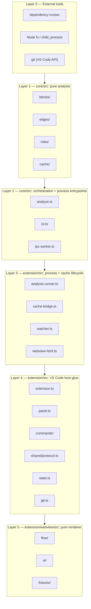

# Architecture — Layers

Six layers, strictly bottom-up. A layer only ever imports from a layer below it. This is
literal — each layer is a directory, not a metaphor.

| Layer | Directory | `vscode` import? | Package | Fully clears at |
|---|---|---|---|---|
| 0 | npm deps | n/a | — | — |
| 1 | `core/src/{blocks,edges,risks,cache}` | **No** — enforced by `core/test/no-vscode-import.test.ts` | `@blocknet/core` | Checkpoint B (`blocks/`, `edges/` truth validated earlier at Checkpoint A; `risks/`, `cache/` are built after A, in Tasks 4–5) |
| 2 | `core/src/{analyze,cli,ipc-worker}.ts` | **No** | `@blocknet/core` | `analyze.ts`/`cli.ts` at Checkpoint B; `ipc-worker.ts` ships with Task 6, alongside `analysis-runner.ts` (`docs/planning/PROGRESS.md`) |
| 3 | `extension/src/{analysis-runner,cache-bridge,change-buffer,webview-html}.ts` | **No** — deliberately kept vscode-free (unlike this table originally assumed) so the fork lifecycle, generation-id bookkeeping, debounce-classification, and built-HTML transformation logic are all unit-testable headlessly, same posture as Layers 1–2. `webview-html.ts` (Task 7) takes `panel.ts`'s vscode-derived strings (`webview.cspSource`, `webview.asWebviewUri(...)` results) as plain parameters rather than the `vscode.Webview` object itself | `@blocknet/extension` | Task 6 for the first three (`docs/planning/PROGRESS.md`); `webview-html.ts` ships with Task 7 |
| 3b | `extension/src/watcher.ts` | Yes — the thin `FileWatcher` shell wiring `vscode.workspace.createFileSystemWatcher` into `change-buffer.ts`; not unit-tested, verified manually via F5 | `@blocknet/extension` | Task 6 |
| 4 | `extension/src/{extension,panel}.ts`, `commands/show-architecture.ts` | Yes | `@blocknet/extension` | Task 6 ships these three; `state.ts` (Task 8, workspaceState positions), `git.ts` and `commands/open-file.ts` (Task 9) land later — full layer clears at Checkpoint C |
| 5 | `extension/webview/src/**` | **No** — will be only `acquireVsCodeApi()` once Task 8 wires it; Task 7's build has zero vscode coupling of any kind, including that | `@blocknet/webview` — its own npm workspace/package (unlike this table originally assumed under `@blocknet/extension`), own `vite build`, consumed by `panel.ts` as a built artifact under `extension/webview/dist/` | Checkpoint C |

## The rule this enforces

Layers 1–2 are `core` — headless, no VS Code, testable from the CLI alone. **Checkpoint A**
(after Task 3) is the go/no-go: blocks and edges must be proven true and fast on real repos
before anything else is built, including the rest of Layer 1 (risks, cache). **Checkpoint
B** (after Task 5) is Layer 1–2 fully complete and its schema frozen. Layers 3–5 (the
extension) do not start until Checkpoint B — "no UI before the truth gate" means the truth
gate must be *passed* (Checkpoint A) and the engine *finished* (Checkpoint B) before Layer 3
begins.

Nothing in Layer 3+ ever imports `core`'s `analyze()` and calls it in-process — see
[PROCESS-BOUNDARY.md](./PROCESS-BOUNDARY.md) for the enforced mechanism and why.
