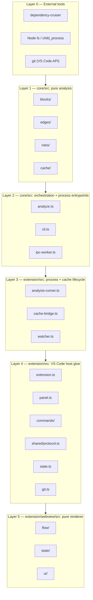

# Architecture — Layers

Six layers, strictly bottom-up. A layer only ever imports from a layer below it. This is
literal — each layer is a directory, not a metaphor.

| Layer | Directory | `vscode` import? | Package | Fully clears at |
|---|---|---|---|---|
| 0 | npm deps | n/a | — | — |
| 1 | `core/src/{blocks,edges,risks,cache}` | **No** — enforced by `core/test/no-vscode-import.test.ts` | `@blocknet/core` | Checkpoint B (`blocks/`, `edges/` truth validated earlier at Checkpoint A; `risks/`, `cache/` are built after A, in Tasks 4–5) |
| 2 | `core/src/{analyze,cli,ipc-worker}.ts` | **No** | `@blocknet/core` | Checkpoint B (`ipc-worker.ts` ships with Task 5) |
| 3 | `extension/src/{analysis-runner,cache-bridge,watcher}.ts` | Yes | `@blocknet/extension` | Checkpoint C |
| 4 | `extension/src/{extension,panel,commands}.ts`, `state.ts`, `git.ts` | Yes | `@blocknet/extension` | Checkpoint C |
| 5 | `extension/webview/src/**` | **No** — only `acquireVsCodeApi()` | `@blocknet/extension` (own build) | Checkpoint C |

## The rule this enforces

Layers 1–2 are `core` — headless, no VS Code, testable from the CLI alone. **Checkpoint A**
(after Task 3) is the go/no-go: blocks and edges must be proven true and fast on real repos
before anything else is built, including the rest of Layer 1 (risks, cache). **Checkpoint
B** (after Task 5) is Layer 1–2 fully complete and its schema frozen. Layers 3–5 (the
extension) do not start until Checkpoint B — "no UI before the truth gate" means the truth
gate must be *passed* (Checkpoint A) and the engine *finished* (Checkpoint B) before Layer 3
begins.

Nothing in Layer 3+ ever imports `core`'s `analyze()` and calls it in-process — see
[PROCESS-BOUNDARY.md](./PROCESS-BOUNDARY.md) for the enforced mechanism and why.
