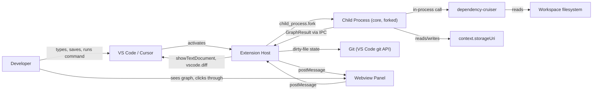

# Architecture — Overview

**Scope of BlockNet v1:** render a TS/JS repository's block-level architecture graph —
accurately and fast — with import cycles and one boundary violation flagged, inside a VS
Code webview that sits beside the editor.

## Thesis

Normal AI IDEs treat the text buffer as the primitive; architecture lives in the
developer's head. BlockNet treats the **architecture graph** as the primitive. Linters
(eslint/ruff/tsc) check *code*; nothing checks the map. BlockNet is the aggregation layer
that turns existing analyzers' output into one navigable, spatial architecture.

## System context

Five participants, five responsibilities. No participant does another's job.

| Participant | Owns | Never does |
|---|---|---|
| `core` (child process) | Truth: blocks, edges, risks, cache | Touch `vscode`, render anything |
| Extension host | VS Code integration, process lifecycle, native delegation | Heavy computation, own editor/diff UI |
| Webview | Canvas rendering, camera/selection state | Own the graph data, talk to disk/git/child processes |
| dependency-cruiser | Import resolution (aliases, barrels, workspaces) | — never re-implemented |
| VS Code itself | Editor, diff, Timeline, theme | — never rebuilt ([decisions/0009](../decisions/0009-native-delegation-split-screen.md)) |

## See also

- [LAYERS.md](./LAYERS.md) — the module layering that enforces this diagram
- [DIRECTORY-TREE.md](./DIRECTORY-TREE.md) — where every file above lives
- [ENGINEERING-CONSTRAINTS.md](./ENGINEERING-CONSTRAINTS.md) — binding VS Code extension rules
- [../PRINCIPLES.md](../PRINCIPLES.md) — why this shape, not another one
