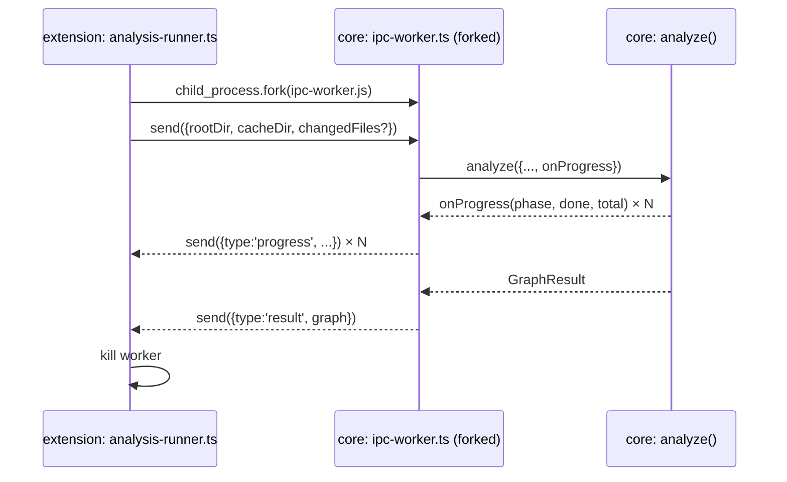

# Architecture — Process Boundary

`core` never runs on the extension host thread. This is how that boundary is actually
crossed — see [decisions/0011](../decisions/0011-process-boundary-fork-not-spawn.md) for
the alternatives considered.

## Mechanism: `child_process.fork()`

`fork()` gives a structured IPC channel (`process.send` / `on('message')`) — no parsing
JSON out of stdout, no risk of a stray `console.log` in a transitive dependency corrupting
the stream.

## Two entrypoints, two contracts, one function

`core/src/cli.ts` and `core/src/ipc-worker.ts` are both thin adapters over
`core/src/analyze.ts`. Neither contains logic.

| Entrypoint | Caller | Contract |
|---|---|---|
| `cli.ts` | Terminal, CI | stdout text + a final JSON blob (`--json`) |
| `ipc-worker.ts` | `extension/src/analysis-runner.ts` | structured `process.send({type:'progress'\|'result', ...})` |

## Sequence

## Lifecycle: one-shot, not long-lived

`analysis-runner.ts` forks a fresh worker per analysis run (cold or incremental) and kills
it after the result arrives, rather than keeping one process alive across runs. Simpler
lifecycle, no state leakage between runs — and triggers reaching this layer are already
debounced by `watcher.ts` (~500ms, see [FLOWS.md](./FLOWS.md) §2a), so fork overhead is
never paid per-keystroke. Because a debounce window can still be straddled by two edits,
`analysis-runner.ts` tags every run with a monotonically increasing generation id and only
forwards the result matching the latest one — a run superseded before it finishes is left to
complete and is then discarded, never blocked or killed mid-flight (killing a forked Node
process mid-write is more failure-prone than just ignoring a result that's already on its
way).

## The rule this creates

`extension/` never does `import { analyze } from '@blocknet/core'` and calls it in-process.
The only legal way `extension/` touches `core`'s analysis is forking `ipc-worker.js`.
`core/src/index.ts` is still the correct import for *types* (`GraphResult`, `BlockNode`,
etc.) on both sides of the boundary — only the `analyze()` *call* is process-isolated.
