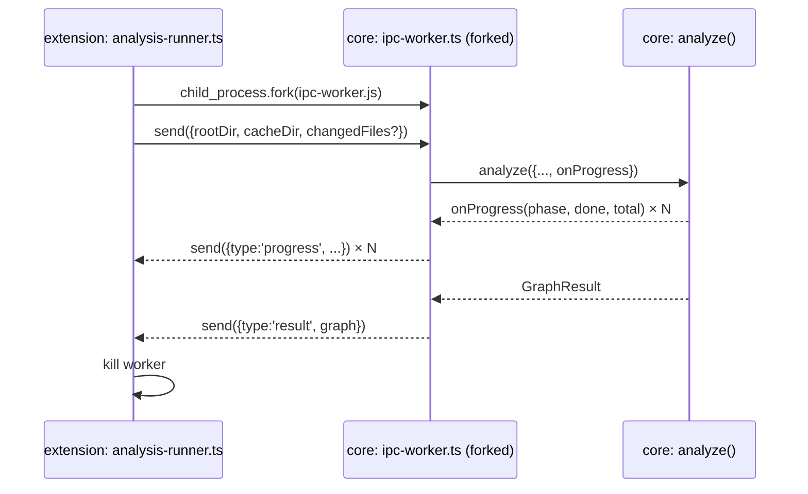

# Architecture — Process Boundary

`core` never runs on the extension host thread. This is how that boundary is actually
crossed — see [decisions/0011](../decisions/0011-process-boundary-fork-not-spawn.md) for
the alternatives considered.

## Mechanism: `child_process.fork()`

`fork()` gives a structured IPC channel (`process.send` / `on('message')`) — no parsing
JSON out of stdout, no risk of a stray `console.log` in a transitive dependency corrupting
the stream.

## Two entrypoints, two contracts, one function

`core/src/cli.ts` and `core/src/ipc-worker.ts` are both thin adapters over
`core/src/analyze.ts`. Neither contains logic.

| Entrypoint | Caller | Contract |
|---|---|---|
| `cli.ts` | Terminal, CI | stdout text + a final JSON blob (`--json`) |
| `ipc-worker.ts` | `extension/src/analysis-runner.ts` | structured `process.send({type:'progress'\|'result'\|'error', ...})` — `'error'` (not an uncaught crash) when `analyze()` rejects, e.g. a nonexistent `rootDir` |

## Sequence

## Where the forked file physically lives (Task 6)

`extension/dist/ipc-worker.mjs` is not built by extension's own esbuild — it's copied
verbatim from `@blocknet/core`'s own build output (`core/dist/ipc-worker.js`, produced by
`core/tsup.config.ts`) as a build step in `extension/esbuild.config.ts`, then renamed to the
`.mjs` extension. Two things this depends on, both verified empirically while wiring Task 6,
not assumed:

1. **ESM, not CJS.** `dependency-cruiser` (a transitive import of `analyze()`) has genuine
   top-level `await` in some of its own source files. esbuild cannot lower that into a CJS
   output at all (`extension/dist/extension.js`, the host bundle, *is* CJS — plain `.mjs` on
   the worker sidesteps needing it to match, since the worker always runs as its own
   standalone forked process, never `require()`-d by anything).
2. **`core/tsup.config.ts` sets `splitting: false`.** tsup's default multi-entry behavior
   shares code across entries that import overlapping modules (every entry here touches
   `analyze.ts`'s graph) via a separate chunk file. Copying `ipc-worker.js` out of
   `core/dist/` in isolation — which is what the extension build does — would silently break
   if that chunk existed: `ipc-worker.mjs` would still `import` a sibling file that never
   made the trip, failing at `fork()` time with `ERR_MODULE_NOT_FOUND`, not at build time.
   `splitting: false` makes every one of core's dist entries fully self-contained.

`analysis-runner.ts`'s `AnalysisRunner` class takes the worker's path as a constructor
parameter rather than computing it from its own `__dirname` — it only resolves correctly
once bundled into `extension/dist/`, and `extension.ts` (which lives in that same bundle,
and is the only caller) is what actually knows its own `__dirname` at runtime. This also
means `AnalysisRunner` can be unit-tested against the real forked worker without needing to
run inside a real extension host.

## Lifecycle: one-shot, not long-lived

`analysis-runner.ts` forks a fresh worker per analysis run (cold or incremental) and kills
it after the result arrives, rather than keeping one process alive across runs. Simpler
lifecycle, no state leakage between runs — and triggers reaching this layer are already
debounced by `watcher.ts` (~500ms, see [FLOWS.md](./FLOWS.md) §2a), so fork overhead is
never paid per-keystroke. Because a debounce window can still be straddled by two edits,
`analysis-runner.ts` tags every run with a monotonically increasing generation id and only
forwards the result matching the latest one — a run superseded before it finishes is left to
complete and is then discarded, never blocked or killed mid-flight (killing a forked Node
process mid-write is more failure-prone than just ignoring a result that's already on its
way).

## The rule this creates

`extension/` never does `import { analyze } from '@blocknet/core'` and calls it in-process.
The only legal way `extension/` touches `core`'s analysis is forking the worker file.
`core/src/index.ts` is still the correct import for *types* (`GraphResult`, `BlockNode`,
etc.) on both sides of the boundary — only the `analyze()` *call* is process-isolated.

One deliberate, narrow exception: `extension/src/watcher.ts` imports `isExcludedPath` as a
*value* from `@blocknet/core/path-utils` — a separate, dedicated export (not the main
barrel) that stays fully decoupled from `analyze.ts`'s `dependency-cruiser` graph (see
`core/src/index.ts`'s header comment and `docs/decisions/0011`'s 2026-07-20 amendment). This
doesn't violate the rule above — it's not `analyze()`, and it doesn't run in-process
analysis — it's a small, dependency-free predicate shared so the watcher's own exclude
filtering can't silently drift from core's, the same failure class `docs/planning/
PROGRESS.md`'s Task 3 entry already names.
